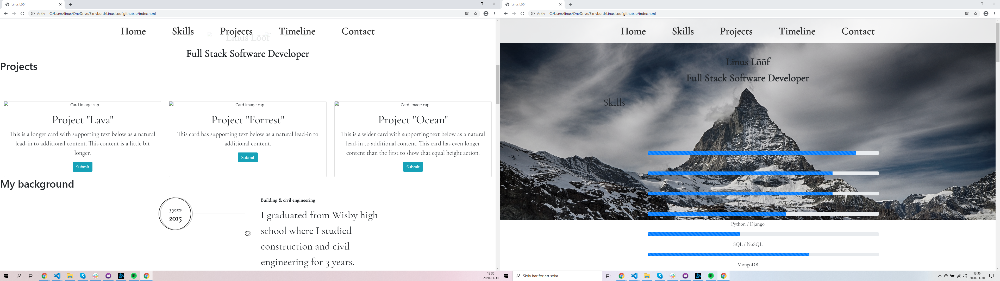
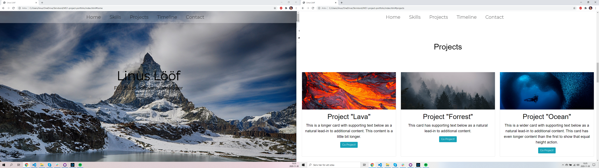
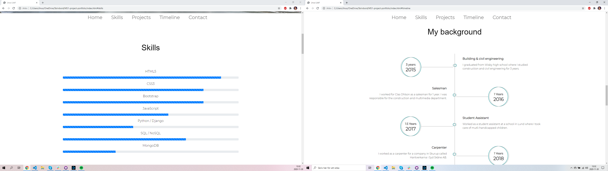

# MS1-PROJECT-PORTFOLIO

Welcome to my portfolio, on this site you get to know me better and i hope that i can get to know you too!

---

# Table of contents

* [Inspiration](#Inspiration)
* [UX](#UX)
* [Screenshots](#screenshots)
* [Features](#features)
* [Testing](#testing)
* [Technologies](#technologies)
* [Code](#code/sources)
* [Deployment](#deployment)
* [Contact](#Contact)

---

## Inspiration

I got a lot of inspiration from Apple's website as I wanted it very clean just like their website. I was also in other people's portfolios and checked a bit how they had done on their websites. but mostly it was to google around on pages I like and see how they did.

---

# UX

I chose to make a portfolio as my first project in this course as a basis in order to build my brand outwards when I apply for a job. My target group is primarily recruiters and future employers. 
I want to demonstrate my strengths' in programming as well as an idea of who I am as a person to facilitate my target group's quest for a future employee.

# Features

## Existing Features

* Feature 1 - A navigation bar for users so they can navigate throw the page nice and smooth.
* Feature 2 - A skills section for recruiters so they easy can get a picture of what i can.
* Feature 3 - Project section that links to my projects.
* Feature 4 - Timeline and contact section that also show recruiters what i have done before and how to get in touch with me. 
* Feature 5 - A contactform for people to contact me.
* Feature 6 - Footer with social media links and a link to download my resume.

## Feature ideas to Implement

* I have an idea of makeing a nicer frontpage header with js
* The project section i wan't to do like a carusell thing so the pictures are much bigger and to add text on the pictures. This also whit js.
* Fix the submit button so the form works.

---

# Screenshots

This is a picture before my first mentor call my code were broken and things weren't were its supposed to be. 

1. At first i had a grayscale on my background pic whitch looks nicer whitout.
2. Several parts was "broken" in terms of alignment, mostly on mobile and tablets.
3. I had alot of problems with the navigation bar, it broke on mobile and tablets. 
4. In the beginning i didn´t use boostrap so much and i became a problem further in the project.

This are pictures when im almost finished. 

1. First i choosed to have the background picture cover the whole front page. Then i took away the grayscale becuse it looks more nice without it.
2. I fixed the broken parts mostly the navbar so it fits mobile and tablets. I used media Querys to solve most problems with the navbar and profilepicture. then i started to use bootstraps "row" and "col" to solve the alignment issues i had on the page. 

---

# Testing

### My methods for testing my webpage consisted of:

* Using the inspector tool to test if the page was responsive on serveral different devices. 
* Having other people around me try to navigate the page and look for bugs that I didn't catch myself.
* Code validator.
* In the future I plan to implement automated tests.

My UX goals was to create a website that displayed my programming strengths' and personality to my target group (recruiters and future employers). 

* I believe by creating a well-working and aesthetic website my target group can see my strength in the frontend department. Later when I have backend projects to use in the "projects" section, I can also provide a showcase of strengths' in the backend department.

* I try to present my personality via the section called "My background" which contains a timeline of my previous workplaces and what I have studied before. Another section is called "Contact" which goes more in depth and has a little less formal tone.

### Here is some examples of bugs that I encounterd during testing:

* After trying to implement a responsive page, I didn't get the navigation bar to work correctly on smaller devices.
1. When viewing the page on mobile or a tablet, the navigation bar had been switched into a dropdown "hamburger" menu. But when clicking on the hamburger icon, the dropdown didn't drop down to show the menu options.
2. I solved this by adding an invisible checkbox that was layered above the hamburger icon. This way I could check for when the dropdown menu was clicked using the :checked selector in css. When the checkbox was checked I made the dropdown menu visible.

* During testing I also found an issue when viewing tablet devices. The problem was that I didn't get it correctly responsive for Ipad.
1. Using the inspector tool, I tested the page on a Ipad view. 
2. After looking for bugs in the Ipad view, I noticed that some of the different sections where meshed together.
3. Using media querys in the css, I made an exception for the existing margins when on a Ipad sized view.

---

# Technologies

This projects is created with

* CSS3
* HTML5 
* Bootstrap 4 - is the framework i used to facilitate my coding.

---

# Code/Sources

## Content

Here i found how to put my text behind the background picture. I used "z-index" to solve this problem.

https://stackoverflow.com/questions/1093955/make-the-image-go-behind-the-text-and-keep-it-in-center-using-css

I used hexcolortool for all my colors in the page. 
I thought it was a very good and user-friendly tool for finding the right color.

https://www.hexcolortool.com/#351a42,0.87

I used stackoverflow a couple of times in my project, here i used it to find how i scroll to a specific element on my website.

https://stackoverflow.com/questions/24739126/scroll-to-a-specific-element-using-html

I thought this timeline fit perfectly on my website, so I used it. I changed the text to suit me and my experience. I also changed the color of it so that it would fit more in my page.

https://www.bootdey.com/snippets/view/bs4-my-experience-timeline

I used boostrap google map to get a map and shape for my page.

https://mdbootstrap.com/docs/jquery/javascript/google-maps/

Stackoverflow again where I needed help to get the media query right in different devices.

https://stackoverflow.com/questions/53701003/how-to-remove-the-hamburger-menu-icon-in-desktop-screen-but-only-needed-in-mobil

# Media

## Project "lava"

https://media.nationalgeographic.org/assets/photos/325/467/f4dab4c6-62a2-4c4f-acd0-5886ccca6f92.jpg

https://www.youtube.com/watch?v=EZjevnnkA20

## Project "Forrest"

https://images.unsplash.com/photo-1476362555312-ab9e108a0b7e?ixlib=rb-1.2.1&auto=format&fit=crop&w=1000&q=80

https://www.youtube.com/watch?v=uPIEn0M8su0

## Project "Ocean"

https://cdn.theatlantic.com/assets/media/img/photo/2020/01/winners-2019-ocean-art-underwater-p/u03_Kao/main_1500.jpg

https://www.youtube.com/watch?v=BDocp-VpCwY

## Backgrpund picture

https://cdn.pixabay.com/photo/2016/11/06/17/11/zermatt-1803481_960_720.jpg

## Icons for skills section

https://jquery-plugins.net/image/plugin/bootstrap-4-the-most-popular-html-css-and-js-library.jpg

https://g.foolcdn.com/art/companylogos/square/mdb.png

https://www.opengis.ch/wp-content/uploads/2020/04/django-python-logo-e1588009010920.png

https://cloudblogs.microsoft.com/uploads/prod/sites/32/2020/05/SQL.png

https://www.buildableweb.com/pub/photo/thumb/512px-HTML5-logo.svg_fitbox_700x700.png

https://upload.wikimedia.org/wikipedia/commons/thumb/9/99/Unofficial_JavaScript_logo_2.svg/480px-Unofficial_JavaScript_logo_2.svg.png

https://cdn.pixabay.com/photo/2017/08/05/11/16/logo-2582747_960_720.png

---

## Deployment

Github pages

---

## Contact

E-mail: Linus.loof96@gmail.com

